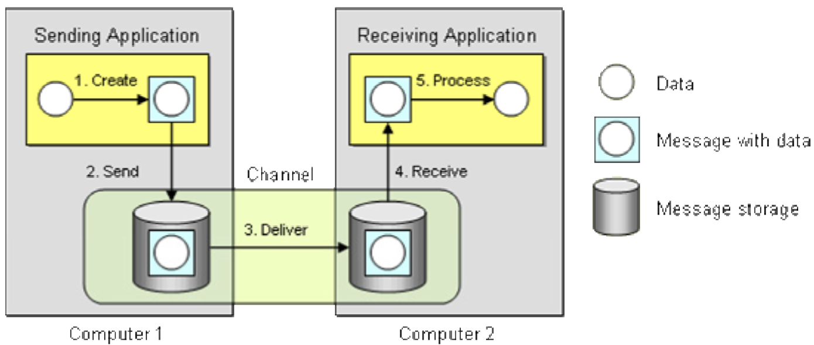
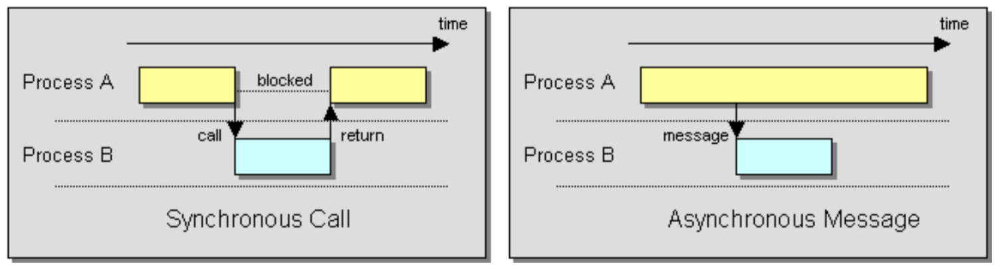
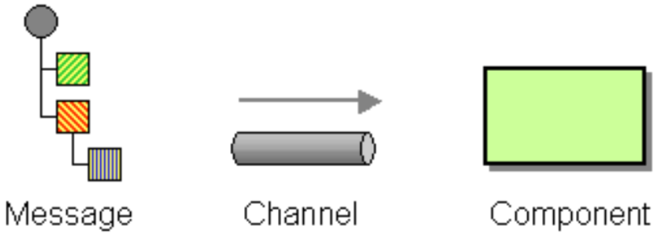
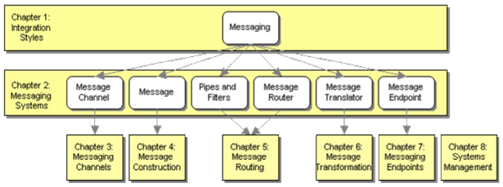

# Ob - Introduction
- Integration challenges
    - networks are unreliable
    - networks are slow
    - any two applications are different
    - change is inevitable
    
- Approaches
    - file transfer
    - shared database
    - remote procedure invocation
    - messaging
    
## What is messaging
- _Messaging_ is a technology that enables high-speed, asynchronous, program-to-program communication with reliable delivery
    - _message_: packet of data
    - _channel_: (aka queue) connect programs and convey messages
    - _sender_ or _producer_: program writing _messages_ to _channel_
    - _receiver_ or _consumer_: program reading (and deleting) _messages_ from _channel_
    
- _Message_
    - _header_: meta-information about the messagge
        - from, to, ...
        - mostly only used by messaging system
    - _body_: 
        - data, command to be invoked on receiver, event occurred in sender
        - string, record, object
        - ignored by messaging system
        
## What is a messaging system
- Database system
    - manages data persistence
    - admin creates schemas
- Messaging system 
    - manages messaging
    - admin configures channels
    
- Message is transmitted in 5 steps:

    - Step 2: send and forget
    - Step 2, 3, 4: store and forward 
    
## Why use messaging
- remote communication
- platform/language integration
- asynchronous communication: send and forget
- variable timing
    - sender can batch requests at own pace
    - receiver can process requests at own pace
- throttling: receiver controls rate at which it consumes requests
- reliable communication: store and forward + retry
- disconnected operation
- mediation: after being disconnected, only need reconnect to messaging system, not all other applications
- thread management: non-blocking

## Challenges
- complex programming model
- sequence issues
- synchronous scenarios
- performance: messaging is best suited to keep systems in sync after initial data replication
- limited platform support
- vendor lock-in

## Thinking asynchronously

- Implications:
    - multiple threads of execution
    - results arrive via a callback
    - asynchronous sub-processes can execute in any order
    
## Pattern form
- Pattern:
    - decision reader needs to make
    - considerations for decision
    - fixed form
- Pattern language
    - web of related patterns
    - guiding reader through decision making process
    
## Diagram notation

## Organization of this book
