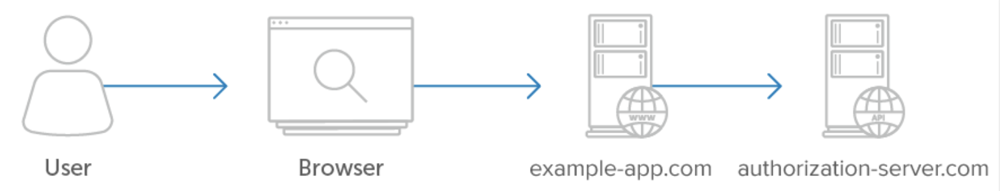

# [04 - Server-Side Apps](https://www.oauth.com/oauth2-servers/server-side-apps/)

- Browser only communicates with client application
- Client application makes API requests to service
- Source code of application not publicly available
- Can keep `client_secret` confidential

## [4.1 - Authorization Code Grant](https://www.oauth.com/oauth2-servers/server-side-apps/authorization-code/)
- Authorization code is a temporary code which can be exchanged for access token
    1. Application starts authorization request `response_type`: `code`
    2. User authorizes application
    3. Redirect to application with `code` and `state` query parameters
    4. `code` exchanged for access token using `client_id` and `client_secret`
- Security
    - `code` is only useful whit `client_secret`
    - `access_token` never visible to user
    - [PKCE](https://www.oauth.com/oauth2-servers/pkce/) recommended for server-side apps

## [4.2 - Example Flow](https://www.oauth.com/oauth2-servers/server-side-apps/example-flow/)
- Same steps as in 4.1

## [4.3 - Possible Errors](https://www.oauth.com/oauth2-servers/server-side-apps/possible-errors/)
- No redirect, but error shown to user
    - Invalid redirect url
    - Unrecognized `client_id`
- Redirect with with `error`, `error_description` (optional), `error_uri` (optional)
    - `access_denied`: user denies request  
    - `invalid_request`: invalid parameters
    - `unauthorized_client`: client not authorized to request code using this method
    - `unsupported_response_type`
    - `invalid_scope`
    - `server_error`
    - `temporarily_unavailable` 

## [4.4 - User Experience Considerations](https://www.oauth.com/oauth2-servers/server-side-apps/user-experience/)
- Show authorization page in web browser user is working with
- Not in iframe popup or embedded browser in mobile app

## [4.5 - Security Considerations](https://www.oauth.com/oauth2-servers/server-side-apps/security-considerations/)
- If app can't protect `client_secret` (e.g. mobile app or pwa)
    - Use Proof Key for Code Exchange (PKCE, pronounced pixie) instead
- Use `https` redirect URLs