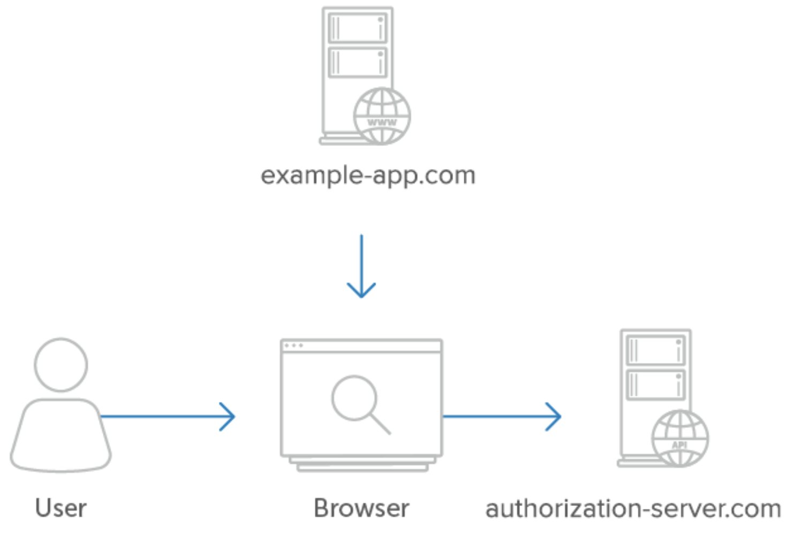

# [05 - Single-Page Apps](https://www.oauth.com/oauth2-servers/single-page-apps/)

- SPA served by client application
- SPA makes API requests directly to service within browser
- Can not keep `client_secret` confidential in browser
- Authorization code is exchanged for an access token without using the `client_secret`

## [5.1 - Authorization](https://www.oauth.com/oauth2-servers/single-page-apps/#authorization)
1. Application starts authorization request `response_type`: `code`
2. User authorizes application
3. Redirect to application with `code` and `state` query parameters
4. `code` exchanged for access token using `client_id` and without `client_secret`

## [5.2 - Example Flow](https://www.oauth.com/oauth2-servers/single-page-apps/#example)
- Same steps as in 5.1 

## [5.3 - Implicit Flow](https://www.oauth.com/oauth2-servers/single-page-apps/#implicit)
- Avoid the implicit flow!
- Bypasses code exchange step
- Access token returned in query string instead of code

## [5.4 - Security Considerations](https://www.oauth.com/oauth2-servers/single-page-apps/#security-considerations)
- Security is maintained by registration of the redirect URL, only way to 'verify' identity of client
- Use `state` parameter as CSRF protection mechanism
- Use Proof Key for Code Exchange (PKCE, pronounced pixie)