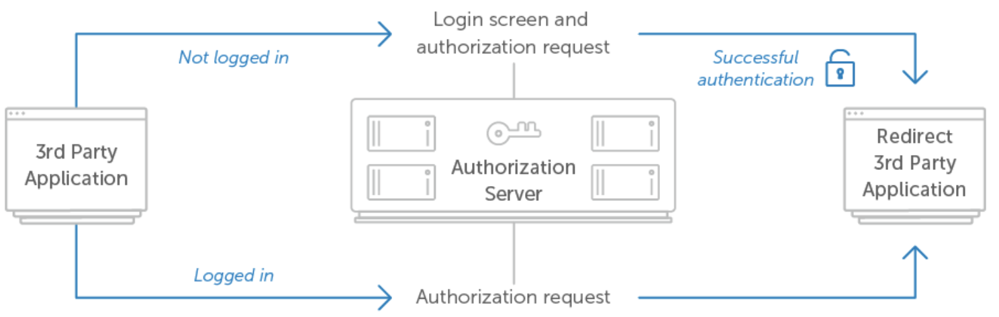

# [09 - Authorization](https://www.oauth.com/oauth2-servers/authorization/) 
When building an OAuth 2.0 service from scratch an authorization interface is needed.
This is the screen users see when granting applications access to their account.

## [9.1 - The Authorization Request](https://www.oauth.com/oauth2-servers/authorization/the-authorization-request/)
- User is redirected to the server with the query parameters client has set
- Validate the request  
    - Known `client_id`
    - Valid and known `redirect_uri` for `client_id`
    - Supported `response_type`
    - Known `scope`
- Invalid
    - `redirect_uri`: show issue to user and do not redirect
    - otherwise, redirect with `error` query parameter

## [9.2 - Requiring User Login](https://www.oauth.com/oauth2-servers/authorization/requiring-user-login/)
- Require login or remember user
- Force login option in user authorization url to give client option to require login
- Provide user with option to login and optionally to create an account
- Typically successful login also means user authorizes application

## [9.3 - The Authorization Interface](https://www.oauth.com/oauth2-servers/authorization/the-authorization-interface/)
- Present all information necessary to make an informed decision about authorizing the application
    - Service name, logo, ...
    - User identification: show currently signed in account
    - Application details: name, logo, website, description, ...
    - Human-readable requested scopes
    - Requested or effective lifetime of access token
- Allow and deny buttons    

## [9.4 - The Authorization Response](https://www.oauth.com/oauth2-servers/authorization/the-authorization-response/)
- Authorization code response
    - Generate authorization code
        - lifetime of 30 to 60 seconds
        - self encoded: encode all necessary info in code (e.g. JWT)
    - Redirect to application with `code` and `state`
- Implicit grant type response
    - Generate access token
    - Redirect to application with `access_token`, `expires` and `state`
- Error response
    - `redirect_uri`: show issue to user and do not redirect
    - otherwise, redirect with `error`, `error_description`, `error_uri` and `state` query parameter

## [9.5 - Security Considerations](https://www.oauth.com/oauth2-servers/authorization/security-considerations/)
- Phishing attack to steal user credentials
    - use `https`
    - educate developers and users
    - application validation by service
- Clickjacking
    - load authorization url in native browser
- Redirect url manipulation: redirect url under attacker control
    - validate `redirect_uri`
    - use `https` to avoid spoofing